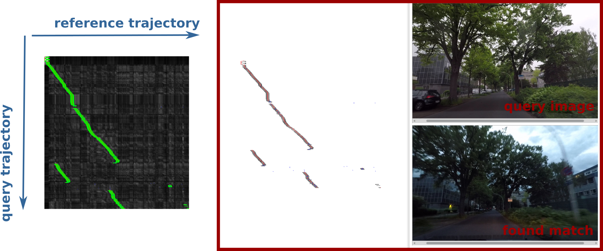

# Examples

To illustrate how this code can be used, we provide small demos.
To run the demos download the datasets, using:

`./download_sample_data.sh`

In this example, the image sequence (trajectory) 0 is  a query trajectory and image sequence (trajectory) 2 is a reference trajectory. To get the system running try one of the following scripts:

1. Run feature based matching with our Dimension Hashing (DH):
`./run_dh_matching.sh`

2. Run feature based matching with OpenCV implementation of Locality Sensitive Hashing (LSH):
`./run_lsh_matching.sh`

3. For evaluation purposes you can run the framework without visualizer by calling
`./run_dh_matching_no_vis.sh`

We also provide the examples how to run the code with precomputed cost matrices. The cost matrix is provided.

4. Run cost matrix based matching 
`./run_dh_matching_matrix.sh`

To run the code, you will need the `config_file.yaml`. For this dataset the config file is already provided in folder `examples`.

## Expected output

#### Feature based matching. Visualizer
During the program execution you should see the results in the provided visualizer.

The main window of visualizer (marked with red square) is divided in two parts: left and right.  In the right part on the top, you can see the query images and bottom part found match from the reference sequence. If no match is found, you should see a black image.

The left part shows the parts of the computed cost matrix, e.g. matches that are needed to find the path. You can only see partial matches that the program has actually computed. The full cost matrix is NOT computed internally, however you can see that the path in the visualizer corresponds to the green path within the full cost matrix, depicted to the left. This indicates that the search is successful.

After the matching is finished, **close** the visualizer. The program will generate  the `matched_path.txt` with the final data associations.
Every line of the output file has the following format:

`quId refd status`, where  `quId` - id of a query image, `refId` - id of the corresponding image found in the reference trajectory,  `status` - **hidden** / **real** (0/1). 

Only **real** nodes correspond to valid matches.

### Cost matrix based matching

The `matched_path.txt` will be generated automatically upon completion of localization. Additionally, the code will generate `result.png`. There you can see the cost matrix with overlayed path as well as expended nodes (green).
